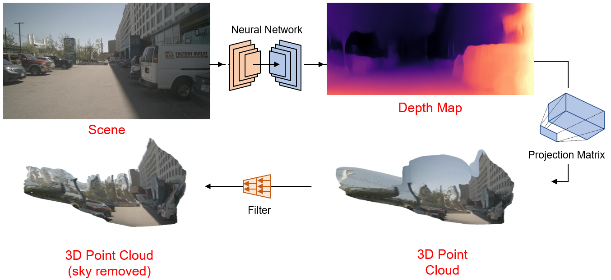

# Image2PCL
Enter the metaverse with 2D image to 3D projections!
<br>
This is an implementation of an algorithm to project 2D images into the 3D space. See below for a visual summary of the project
<br><br>
<p align="center">
  
</p>
<br><br>
The published code is inspired by the following works:
<br>
Monodepth2: https://www.github.com/nianticlabs/monodepth2
<br>
MMSegmentation: https://www.github.com/open-mmlab/mmsegmentation

## Setup
Assuming you have already set up an [Anaconda](https://www.anaconda.com/download/) environment with PyTorch, CUDA and Python, install additional dependencies with:
```shell
pip install open3d
pip install mmcv-full=={mmcv_version} -f https://download.openmmlab.com/mmcv/dist/cu113/torch1.10.0/index.html
```
Clone the [mmsegmentation](https://github.com/open-mmlab/mmsegmentation) repository to your working directory
```shell
git clone https://github.com/open-mmlab/mmsegmentation
```

## Test
To run a test, it is preferred to use images from a dataset with known camera intrinsics. For this implementation, we use two different datasets:
* KITTI Raw for single image testing
* nuScenes for multi-view images testing

<br>

To test on KITTI, run the following (replace the "<>" brackets and contents inside with the correct information):
```shell
python img2pcl.py \
--image_path <path to single image file or folder containing single image> \
--model_path <path to trained KITTI model> \
--data_type kitti_raw
```

To test on nuScenes to view a 360 3D point cloud, run the following (replace the "<>" brackets and contents inside with the correct information):
```shell
python img2pcl.py \
--image_path <path to folder containing nuScenes multi-cam images> \
--model_path <path to trained nuScenes model> \
--data_type nuscenes \
--nusc_camera_parameters <path to a json file containing nuscenes camera intrinsics and extrinsics>
```
